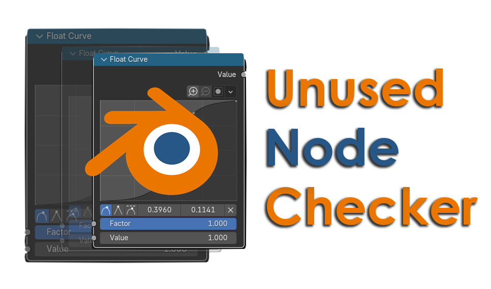
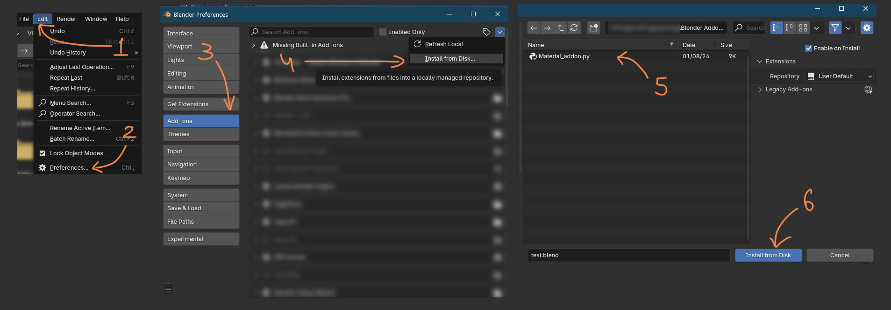
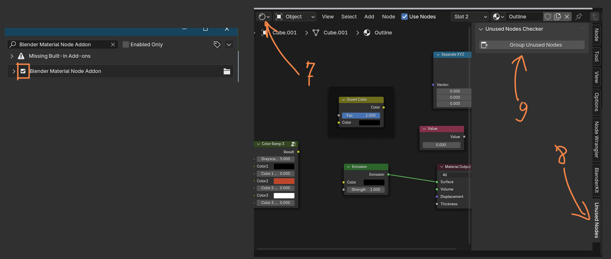
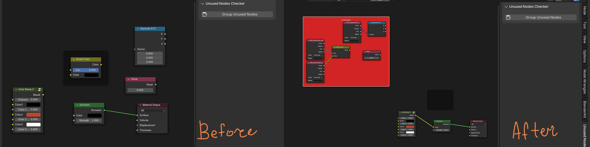
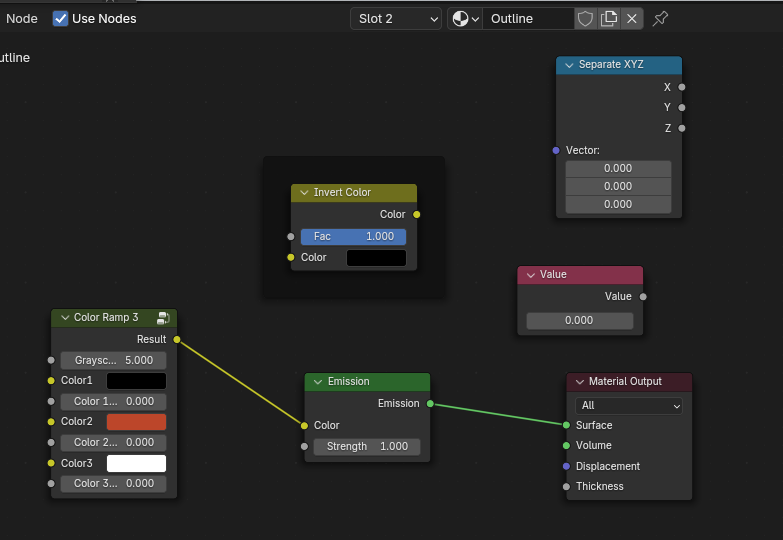
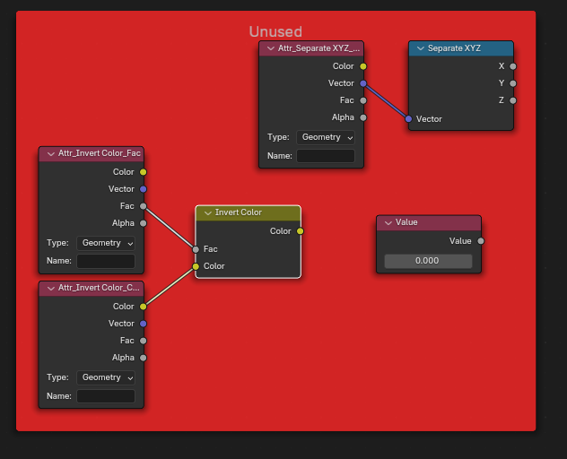
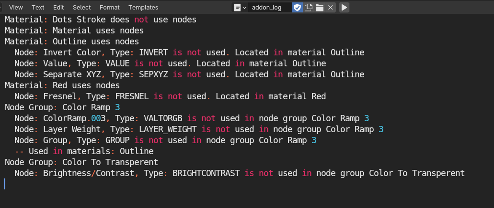

# Blender Material Node Addon

**Версия:** 1.0

**Автор:** Kon4ka

## Описание
Blender Material Node Addon предназначен для быстрой сборки и управления неиспользуемыми нодами в материалах. Этот аддон автоматически находит неиспользуемые ноды в материалах и группах нод, добавляет к ним кастомные атрибуты и организует их в отдельный фрейм "Unused". Это помогает поддерживать чистоту и порядок в ваших нодовых деревьях, облегчая работу с материалами.

## Основные функции
- Автоматический поиск неиспользуемых нод в материалах и группах нод.
- Добавление кастомных атрибутов ко входам неиспользуемых нод со связью по передаваемому значению (Color, float, vector). 
- Организация неиспользуемых нод в отдельный фрейм "Unused" для удобства.
- Поддержка всех типов нодовых деревьев, включая вложенные группы нод.
- Поддержка отмены через Ctrl+Z

## Установка
1. Скачайте аддон с GitHub.
2. В Blender перейдите в `Edit > Preferences > Add-ons`.
3. Нажмите `Install` и выберите скачанный файл аддона Material_addon.py.

4. Активируйте аддон в списке.
5. Он появится в Shader Editor'е в панели справа. 

## Использование
1. Перейдите в редактор нод в Blender.
2. Выберите в панели справа (N панель) кнопку "Group unused nodes"
3. Аддон автоматически найдет и организует неиспользуемые ноды во всех материалах и группах нод.

## Вход
Сцена с некоторым количеством материалов (возможны вложенные группы).

## Выход
Группы нод фо фрейме Unuset в каждом материале или группе где они есть.  

Файл addon_log со списком неиспользованных нод и где они были найдены:

## Контакты
Если у вас есть вопросы или предложения, вы можете связаться со через GitHub.
